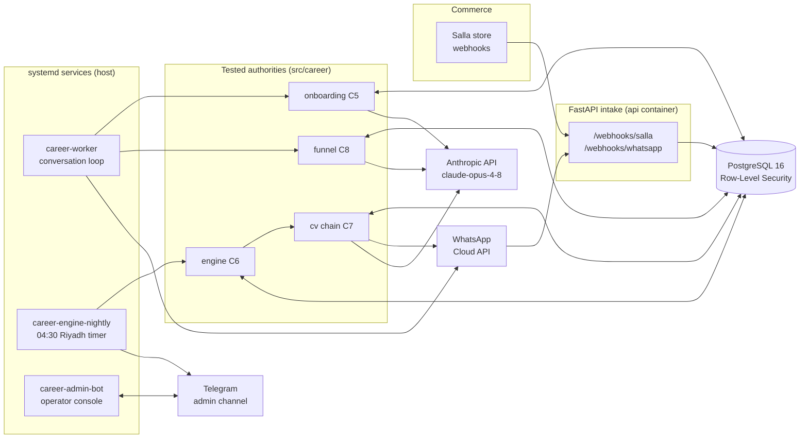

# Career Platform

[](https://github.com/2fahad2/career-platform/actions/workflows/ci.yml)

Paid personal job-search assistant for the Saudi market (WhatsApp + Salla).
Every night it discovers jobs, filters them through each customer's **private
gate**, generates a **tailored English CV with Claude** for every selected
opportunity, and delivers the bundle over WhatsApp so the customer applies
themselves. **A tool — never a recruitment agency, never auto-apply.**

> **Source of truth:** [`docs/WHITEPAPER.html`](docs/WHITEPAPER.html) +
> [`docs/CHANGELOG-v1.1.md`](docs/CHANGELOG-v1.1.md). The whitepaper precedes
> the code (invariant §15.15). Read [`CLAUDE.md`](CLAUDE.md) before any change.
> A file-by-file Arabic walkthrough lives in
> [`docs/ARCHITECTURE-AR.md`](docs/ARCHITECTURE-AR.md).

---

## Table of contents

1. [System overview](#system-overview)
2. [The five data flows](#the-five-data-flows)
3. [Repository map — every file explained](#repository-map--every-file-explained)
4. [The 15 engineering invariants](#the-15-engineering-invariants)
5. [Security model](#security-model)
6. [Operations](#operations)
7. [Testing](#testing)
8. [Configuration](#configuration)
9. [Quick start](#quick-start-staging)
10. [Development workflow](#development-workflow)

---

## System overview



**Stack (locked):** Python 3.11+ · FastAPI · PostgreSQL 16 (+ RLS) · Redis ·
SQLAlchemy + Alembic · Docker Compose · pytest. All LLM calls go through the
Anthropic API only.

**Environments:** two fully isolated Compose projects — separate databases,
secrets, volumes, ports. `staging` runs on the EU server (friends alpha);
`production` moves to a Saudi server before wave 2 (an exit gate).

---

## The five data flows

### 1 · Purchase → activation (C3/C4)
`Salla webhook` → signature verify → dedupe-persist (`webhook_events`) →
worker re-verifies the order **via Salla API** (never trusts the payload) →
provisions tenant + subscription **only on `payment = paid`** → activation
token (stored as SHA-256) → customer sends the token on WhatsApp → channel
bound to tenant.

### 2 · Onboarding → ACTIVE (C5)
Merged consent (one tap → three ledger events) → 14 Arabic questions with
progress counters → CV upload through a six-stage hardened pipeline → **PII
stripped**, then Claude extracts facts → customer confirms each fact into the
**achievement bank** (rejected claims land in `forbidden_claims`) → three-layer
career-path assessment → versioned search policy → `ACTIVE` (the 30-day
anchor).

### 3 · Nightly engine (C6)
Query families derived **dynamically from active customers' approved paths** →
SearchAPI google_jobs + JobSpy (isolated fetchers, sanitized failures) →
same-run dedupe → shared pool upsert → cached enrichment behind SSRF guards →
**per-tenant gate** with a persisted decision log (answers «why was this sent
to me?») → suppression filter *before* the cap → deterministic ranking with
versioned rank traces → per-tenant final list.

### 4 · CV + delivery + honest close (C7)
For each selected job: resolve or generate a CV (Claude tailoring chain with
rule fallbacks at every stage — the pipeline survives a dead LLM) → guards:
bank-vocabulary whitelist, invented-content, forbidden claims, Arabic-leak →
**atomic publish** (PDF + sha-bound sidecar) → `validate_cv_binding` is the
sole send authority → grouped WhatsApp delivery (card → document → outcome
buttons per job) → suppression ledger for delivered only → **exactly one of
seven honest day states** per tenant. Real identity is injected locally at
assembly — **no LLM call ever sees PII** (§15.8).

### 5 · Acquisition funnel (C8)
29-SAR CV-analysis product → same consent/upload/extraction authorities →
deterministic scoring against the same path-scoring engine the subscription
uses → one-page Arabic RTL PDF report + WhatsApp summary → upgrade CTA; a
later subscription purchase from the same phone **inherits** the funnel tenant
(half-ready onboarding, nothing deleted).

---

## Repository map — every file explained

### Root

| File | Purpose |
|---|---|
| `CLAUDE.md` | The working constitution: sources of truth, locked stack, the 15 invariants digest, forbidden-without-permission list. |
| `pyproject.toml` | Package metadata, dependencies, ruff (incl. security rules) + strict mypy configuration. |
| `docker-compose.staging.yml` / `docker-compose.production.yml` | Isolated stacks: Postgres 16 (loopback), Redis 7 (loopback), api container. |
| `Dockerfile` | The api container image. |
| `alembic.ini` | Alembic entry point (migrations run as the owner role). |
| `.env.example` / `.env.staging.example` / `.env.production.example` | Complete, always-current templates for every setting. Real `.env*` files are untracked. |
| `Caddyfile` | TLS termination; exposes only `/webhooks/*` + `/health`. |

### `src/career_core/` — the pure kernel (no I/O, no DB)

| File | Purpose |
|---|---|
| `gate.py` | The pure gate calculus: salary certainty buckets, company-quality/role scores, `gate_sort_key` — the deterministic ordering authority. |
| `salary.py` | Salary parsing/classification (`EXPLICIT_CONFIRMED` … `UNKNOWN`) from raw JD text. |
| `identity.py` | Canonical job-identity derivation (`joburl-v1`) — the one identity used by publish, binding and suppression. |
| `sentences.py` | English sentence-quality gate (§1.6): completeness, dangling connectors — blocks half-written summaries. |
| `ssrf.py` | Fail-closed SSRF guard: scheme/host/IP checks with a safe default resolver. |
| `urltools.py` | URL normalization + tracking-parameter stripping (dedupe keys, displayed links). |

### `src/career/` — application core

| File | Purpose |
|---|---|
| `main.py` | FastAPI app: Salla + WhatsApp webhook intake (verify → dedupe → 200, no business logic inline), `/health`. |
| `config.py` | Typed `Settings` (every env var); `get_settings()` also arms the exact-literal secret scrubber. |
| `logging_filters.py` | Secret redaction on every log record: URL/query/KV patterns + registered literals; attached at startup. |
| `audit.py` | Append-only tenant audit-trail writer. |
| `tokens.py` | Activation-token generation/hashing (raw shown once; only SHA-256 stored). |

#### `db/`

| File | Purpose |
|---|---|
| `base.py` | Declarative base with a deterministic naming convention (identical DDL across environments). |
| `models.py` | The whole ORM schema — 30+ tables with RLS notes per table; PDFs never stored in the DB. |
| `session.py` | The two-role discipline: `career_app` sessions with a transaction-local `app.tenant_id` GUC (fail-closed), owner sessions for cross-tenant system work. |

#### `webhooks/` · `queue/`

| File | Purpose |
|---|---|
| `webhooks/intake.py` | Shared fast-intake: fingerprint dedupe into `webhook_events`. |
| `queue/adapter.py` | Redis queue adapter behind a protocol (FIFO, visibility). |
| `queue/message.py` | Queue message envelope (PII-free by contract). |
| `queue/outbox.py` | Transactional outbox relay — events written with the business change, published after commit. |

#### `salla/` — commerce (C3)

| File | Purpose |
|---|---|
| `signature.py` | HMAC-SHA256 webhook verification, constant-time, fail-closed on missing secret. |
| `webhook.py` | Event parsing (order id lives at `data.order.id` in activity wrappers) + intake. |
| `client.py` | Salla API client; the **paid-status whitelist** (unknown method → `pending`, never provision). |
| `provisioning.py` | Order → tenant + subscription + activation token; idempotent by unique order id; **re-verifies via API**. |
| `subscriptions.py` | The 11-state subscription machine with an explicit allowed-transition table + event trail. |

#### `whatsapp/` — messaging (C4)

| File | Purpose |
|---|---|
| `signature.py` | Meta `X-Hub-Signature-256` verification (fail-closed). |
| `webhook.py` | Meta handshake (GET) + inbound intake (POST). |
| `client.py` | The injectable send boundary: text/document/template/interactive + media download; the real Graph client uploads storage refs to `/media`; errors carry status + code only (never bodies). |
| `window.py` | The 24-hour service-window calculus + the operator evening-nudge predicate. |
| `adaptive.py` | Delivery planning: OPEN → direct, CLOSED → template-then-hold, OPTED_OUT → nothing. |
| `delivery.py` | Execution: grouped bundles (header → per job card→document→outcome buttons), honest `COMPLETED/PARTIAL/PENDING/NO_SEND`, per-job failure isolation. |
| `templates.py` | The approved-template registry (names/languages/buttons). |
| `inbound.py` | Inbound classification: activation token / STOP / support / other. |
| `activation.py` + `activation_flow.py` | Token → tenant binding; all validity checks **before any mutation**; the §04 funnel-inheritance exception. |
| `worker.py` | The conversation worker: per-message idempotency, ownership re-verified from the DB, routing to onboarding/funnel, outcome-button recording, receipts, STOP/support handling. |

#### `onboarding/` — C5

| File | Purpose |
|---|---|
| `fsm.py` | The 10-state forward-only journey machine + the single documented regression edge + reminder-due predicate. |
| `orchestrator.py` | The conversation brain: merged consent, 14 questions with progress, batch fact confirmation, privacy commands everywhere, reminders runner. |
| `collection.py` | The question bank (labels ≤ 20 chars by design — WhatsApp button cap) + answer parsing/validation. |
| `consents.py` | Purpose-separated consent ledger (append-only) + fail-closed required-consent gate. |
| `upload.py` | The six-stage hardened CV-upload pipeline: size → magic-byte sniff → scanner hook → structural inspection → metadata sanitization → sandboxed extraction. |
| `extract_worker.py` | The sandbox child process: rlimits set **before** parsing, defusedxml, output caps. |
| `extraction.py` | PII strip → `assert_no_pii` (raises rather than send) → Claude structured extraction; results stored as `EXTRACTED`, never truth. |
| `confirmation.py` | Fact-by-fact / batch confirmation into the achievement bank; rejections feed `forbidden_claims`. |
| `paths.py` | Three-layer career-path assessment (requested / suggested / approved) with weak-fit override flow. |
| `policy.py` | Versioned search-policy builder + Arabic summary card. |
| `privacy.py` | Export / pause / resume / delete (two-step, FK-safe, honors §12 retention). |

#### `engine/` — C6

| File | Purpose |
|---|---|
| `run.py` | The nightly composition: plan → discover → dedupe → pool upsert → enrich → gate → suppress → rank → trace. Honest statuses; `_finish` closes the run row on every exit. |
| `families.py` | Dynamic query families from ACTIVE tenants' approved paths — nothing hardcoded per specialization (D5). |
| `sources.py` | SearchAPI google_jobs + JobSpy adapters: per-query isolation, 45s timeout + retry, HTML stripping, apply-routing (the D13 lessons live here). |
| `identity.py` | Same-run dedupe + cross-source merge rules + repost-group seeds. |
| `enrichment.py` | Once-per-posting page enrichment behind pre- and post-redirect SSRF checks; failures cached as verdicts. |
| `gate.py` | The per-tenant gate: policy strictness (D4), region equivalence, decision log with reasons, near-miss capture. |
| `ranking.py` | Suppression filter (before the cap), deterministic sort, slots, versioned rank traces, the suppression-ledger writer. |
| `quota.py` | SearchAPI credit-watch decision (quiet on trial, warns at 10%, red at zero). |
| `cli.py` | The timer entry point: engine run → admin alerts → credit watch → the C7 delivery phase. |

#### `cv/` — C7

| File | Purpose |
|---|---|
| `schemas.py` | Pydantic models (§1.1 verbatim): `MasterCV`, `TailoredCV`, `ContactInfo`. |
| `template.py` | The v5 HTML template — machine-extracted **byte-verbatim** from the legacy reference, guarded by re-extraction tests. |
| `render.py` | WeasyPrint rendering: deterministic bytes, pinned fonts, exactly one A4 page. |
| `normalize.py` | Bank → `MasterCV` (§1.9): display-company ordering, current-role rules, first-wins skills. |
| `enforce.py` | One-page enforcement: caps 400/4/4/2/14, achievement pacing, JD-ranked fill — no invention. |
| `validate.py` | Pre-render validator: Arabic-leak guard (blocking), structural minimums, style warnings — reason codes only. |
| `prompts.py` | §10 prompts, byte-verbatim; filled by literal `.replace` (never `.format`). |
| `generate.py` | The tailoring chain + all guards (invented-content, forbidden claims, summary gate) + rule fallbacks + the real Anthropic client with token metering. |
| `publish.py` | Atomic pair publish, `validate_cv_binding` (sole send authority, never raises), the §7.5 resolver, budget loop, quarantine. |
| `deliver.py` | Arabic job cards, D8 display filenames, grouped bundle builder, outcome-button parsing/recording. |
| `close.py` | The seven-state daily authority, `close_tenant_day`, admin summary, usage recording + cost rollups. |
| `daily_run.py` | The delivery-day orchestration: per-tenant isolation, stale-held expiry, honest closes, cost metering. |

#### `funnel/` — C8

| File | Purpose |
|---|---|
| `flow.py` | Purchase → merged consent → upload → report → DONE; reuses C5 authorities verbatim; second-purchase reopen. |
| `evaluation.py` | Deterministic five-score analysis on **extracted** facts via the same path-scoring engine; Arabic notes; upgrade steps. |
| `report.py` | One-page Arabic RTL PDF (native Pango shaping) + the WhatsApp summary. |

#### `telegram/` — operator watchtower

| File | Purpose |
|---|---|
| `admin.py` | Bot API client: sanitized sends, inline keyboards with `(id, title)` pairs, long-poll `getUpdates`, body-free errors. |
| `console.py` | The stateless router: operator allowlist, `v1|screen|arg` callbacks, PII-free data readers. |
| `views.py` | Pure Arabic screen renderers (menu / today / health / customers / business / errors) — golden-tested. |
| `messages.py` | Small admin-message builders (TEN codes only). |

#### `storage/` · `worker/`

| File | Purpose |
|---|---|
| `storage/adapter.py` | The `StorageAdapter` protocol (S3-compatible surface) + tenant key helpers. |
| `storage/filesystem.py` | Atomic filesystem implementation: temp → write → fsync → `os.replace` → dir fsync. |
| `worker/worker.py` | Generic queue-consumer scaffolding (ownership re-verification pattern). |

### `migrations/versions/` — schema history

| Migration | Adds |
|---|---|
| `0001` | `tenants`, `documents` — the RLS foundation (`NULLIF` fail-closed GUC policies). |
| `0002` | Transactional outbox + idempotency ledger. |
| `0003` | Append-only audit events. |
| `0004` | Salla billing: plans, subscriptions, activation tokens, webhook intake. |
| `0005` | WhatsApp: channels, deliveries, delivery messages, inbound messages. |
| `0006` | Onboarding: sessions, consents, profiles, facts, forbidden claims, assessments, policies, privacy, uploads. |
| `0007` | Consent total-ordering (`seq` identity column). |
| `0008` | Engine: shared job pool (app read-only), discovery runs, per-tenant decisions + suppressions. |
| `0009` | Profile contact fields (email / LinkedIn / region / city). |
| `0010` | Outcome events (append-only §14 fuel). |
| `0011` | Honest close: usage events, cost allocations, tenant day states. |
| `0012` | Funnel sessions. |
| `0013` | The `cv_analysis` plan row (search entitlements zeroed by design). |
| `0014` | Admin-bot getUpdates cursor (singleton system row). |

### `scripts/` — live runners (thin, over tested parts)

| Script | Purpose |
|---|---|
| `run_worker_loop.py` | The conversation service: WhatsApp + Salla processing, hourly stall-reminder sweep, canary evening window nudge, Telegram heartbeat. |
| `run_nightly.py` | Thin wrapper for the engine CLI (systemd target). |
| `run_admin_bot.py` | The watchtower long-poll loop + live health probes (systemd/Graph/SearchAPI/journald). |
| `ci_create_app_role.py` | Creates the non-superuser `career_app` role in CI. |
| `demo_engine_tenants.py` | Seed/clean demo tenants for engine live proofs. |

### `ops/` — infrastructure as files

| Path | Purpose |
|---|---|
| `engine/systemd/career-worker.service` | The conversation loop (Restart=always). |
| `engine/systemd/career-engine-nightly.{service,timer}` | The 04:30 Riyadh nightly run (Persistent=true). |
| `engine/systemd/career-admin-bot.service` | The watchtower console (isolated from the worker). |
| `backup/backup.sh` | Encrypted restic backup to Backblaze B2: pg_dump + **host storage root** + volume. |
| `backup/restore-test.sh` | Monthly restore drill into a scratch DB (tables + RLS assertions). |
| `backup/systemd/*` | Daily backup timer + monthly restore-test timer. |

### `docs/` — governance

| File | Purpose |
|---|---|
| `WHITEPAPER.html` | The product constitution v1.0: phases C0–C9 with exit conditions, §15 invariants, plans/pricing. |
| `CHANGELOG-v1.1.md` | Approved post-v1.0 decisions (overrides conflicting v1.0 text). |
| `DEVIATIONS.md` | Every approved deviation (D1–D13) with rationale. |
| `PLAN.md` | The full execution plan (P-A → C9). |
| `PROGRESS.md` | Session-by-session state: what shipped, exit-gate status, pending decisions. |
| `ADMIN_BOT_DESIGN.md` | The watchtower design + the external-proposal evaluation. |
| `LEGACY_KNOWLEDGE.md` | Read-only reference from the proven personal engine (templates/prompts extracted byte-verbatim). |
| `ARCHITECTURE-AR.md` | **The Arabic file-by-file walkthrough of this repository.** |
| `policies/*.md` | Privacy / refund / terms (customer-facing). |

---

## The 15 engineering invariants

The full text lives in whitepaper §15; the digest in `CLAUDE.md`:

1. **No auto-apply code path** — ever, not even as an experiment.
2. Every production send passes the gate **structurally** — no flag bypasses it.
3. Delivered-ledger writes only after complete delivery, atomically.
4. Subscriptions only on `payment = paid`, re-verified via Salla API, idempotent.
5. Every CV claim traces to the confirmed achievement bank; `forbidden_claims` honored literally.
6. No document sent before `validate_cv_binding` returns ready; nothing from quarantine.
7. Atomic publish for every PDF/metadata pair.
8. LLM calls are PII-free — identity injected locally at assembly.
9. Job descriptions are untrusted input — the analysis model has no tools, no secrets, no control.
10. RLS enabled + FORCE; adversarial cross-tenant tests in CI.
11. Workers re-verify ownership from the DB — never trust queue payloads.
12. One honest state of seven per customer/day — no silent success.
13. No PII in logs or the admin channel — `TEN-####` codes only, secret filters on every logger.
14. Backups encrypted, off-server, restore-tested periodically.
15. **The whitepaper precedes the code.**

## Security model

- **Tenant isolation:** 26 tables under `ENABLE + FORCE` RLS keyed on a
  transaction-local GUC with `NULLIF` fail-closed semantics; deliberate
  exceptions documented per table. Adversarial tests (forged writes,
  cross-reads, no-context reads) run in CI.
- **Webhooks:** constant-time HMAC verification on both providers; an empty
  secret verifies **nothing** (fail closed); dedupe before processing.
- **Uploads:** magic-byte sniffing (extensions never trusted), structural
  inspection, metadata sanitization, extraction in a rlimited subprocess.
- **LLM boundary:** PII stripped and asserted-absent before any call;
  byte-verbatim prompts; literal placeholder filling (immune to format
  injection); invented-content + forbidden-claims + Arabic-leak guards on
  output; rule fallbacks everywhere.
- **Secrets:** untracked env files; redaction filters + registered literals on
  every logger; error types carry codes, never bodies.

## Operations

```
career-worker.service          conversation loop (3s poll, Restart=always)
career-engine-nightly.timer    04:30 Asia/Riyadh, Persistent=true
career-admin-bot.service       operator console (long-poll)
career-backup.timer            daily encrypted backup → Backblaze B2
career-restore-test.timer      monthly restore drill
```

The Telegram watchtower gives the operator: daily run summaries, per-tenant
cards (TEN codes only), platform health (services, tokens, credits, templates,
backup age), business numbers, sanitized error tails — plus proactive alerts
(discovery failures, credit warnings, evening window nudges).

## Testing

```bash
# disposable DB — NEVER run pytest against staging
DB_HOST=127.0.0.1 DB_PORT=5433 DB_NAME=career_test \
REDIS_HOST=127.0.0.1 REDIS_PORT=6380 \
SALLA_WEBHOOK_SECRET=test_secret_123 \
WHATSAPP_APP_SECRET=wa_app_secret_123 WHATSAPP_VERIFY_TOKEN=wa_verify_123 \
CI_REQUIRE_DB=1 .venv/bin/python -m pytest tests/ -q
```

**646 tests**, zero skips with a full environment. Notable suites: adversarial
RLS, webhook idempotency, upload attack files, CV binding/quarantine, the
seven-state failure matrix, grouped-delivery failure isolation, golden Arabic
renderers, byte-verbatim template/prompt guards, full journey E2Es from raw
Meta payloads. CI: ruff → strict mypy → alembic upgrade + drift check →
pytest against real Postgres/Redis.

## Configuration

Every variable is documented in [`.env.example`](.env.example). Highlights:

| Group | Keys |
|---|---|
| Database | `DB_*` (app role) + `DB_OWNER_*` (migrations/system) |
| Salla | `SALLA_WEBHOOK_SECRET`, `SALLA_API_KEY`, `SALLA_PRODUCT_CATALOG` (product→plan map), `SALLA_TOKEN_EXPIRES_AT` |
| WhatsApp | `WHATSAPP_ACCESS_TOKEN` (permanent system-user), `WHATSAPP_PHONE_NUMBER_ID`, `WHATSAPP_WABA_ID`, `WHATSAPP_APP_SECRET`, `WHATSAPP_VERIFY_TOKEN` |
| LLM / search | `ANTHROPIC_API_KEY`, `SEARCHAPI_API_KEY` |
| Operator | `TELEGRAM_ADMIN_BOT_TOKEN`, `TELEGRAM_ADMIN_CHAT_ID`, `CANARY_TEST_PHONE` |

## Quick start (staging)

```bash
cp .env.staging.example .env.staging     # then fill real secrets (never commit)
docker compose -f docker-compose.staging.yml --env-file .env.staging up -d
docker compose -f docker-compose.staging.yml --env-file .env.staging run --rm api alembic upgrade head
curl -fsS localhost:${API_PUBLISH_PORT:-8001}/health
```

## Development workflow

1. **Docs before code** (§15.15): product-behavior changes start with a
   standalone `docs:` commit to the whitepaper/changelog.
2. **Tests first**: every authority lands with its failure cases; killed test
   runs are cured by rebuilding the disposable `career_test` DB.
3. Conventional commits; code/comments/commits in English; every
   customer-facing string in Arabic.
4. `ruff check src tests scripts` + strict `mypy` + `alembic check` must be
   clean before any commit.
5. Update `docs/PROGRESS.md` at session end — what shipped, exit-gate status,
   pending decisions.
